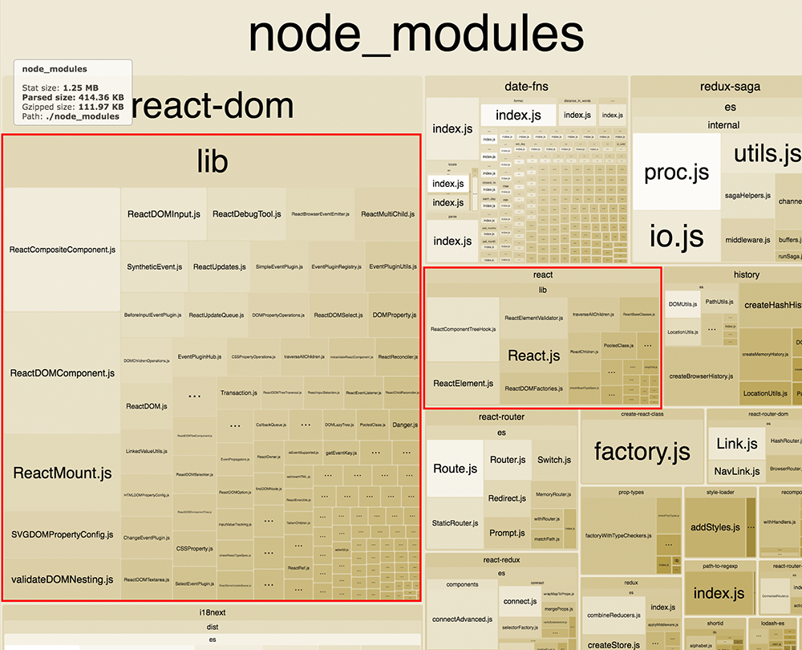

While React is becoming more popular by the day, so are alternatives to the JavaScript framework.

One of these frameworks is [Preact](https://preactjs.com/), which does not aim to do things that
much different per sé, but focuses on performance and bundle size.

This article will take you through the why and how of replacing React with Preact in your existing
project.

<span class="more"></span>

## A bit more about Preact

Preact is the 3kB alternative to React. They strive to provide the same ES6 as React and even
provide an extra layer of compatibility with React, which will make most of the React project work
as intended out of the box!

This compatibility layer is totally optional for using Preact, but is needed for the purposes of
this article.


Even in already existing projects, it's possible to start using Preact instead of React. For me,
this brought instant performance improvements and my bundle size went down significantly.

## Show me the code!

To switch to using Preact instead of React you only need to install Preact's dependencies and adjust
your WebPack configuration accordingly.

First, add Preact to your project:

```
npm install --save preact preact-compat
```

Now adjust your WebPack config to alias `react` to `preact-compat`. In `webpack.config.js` add:

```js
{
  resolve: {
    alias: {
      react: 'preact-compat',
      'react-dom': 'preact-compat',
    },
  },
}
```

There is a more [in-depth explanation of switching to Preact](https://preactjs.com/guide/switching-to-preact)
over at Preact's docs. Give it a read if you don't use WebPack for instance.

In order to get _React Dev-Tools_ working nicely with Preact, I suggest you include the following
snippet in your app's entry point. At least as it's before calling `ReactDOM.render`:

```js
if (module.hot) {
  require('preact/devtools');
}
```

This will add `devtools` compatibility when you're running your app in WebPack's `dev-server` mode.
If you `require` the `devtools` outside of the if-statement it will be included in the production
bundle of your app, best avoid that!

And that's all there is to it!

## But, why switch?

There are many possible reasons one would choose to switch from using React, but the one I've been
hearing a lot as of late is people having concerns around [React's license](https://code.facebook.com/posts/112130496157735/explaining-react-s-license/).

I can imagine people don't want to be dependent on big software companies like Facebook or Google
for their projects. Luckily, [Preact has the MIT license](https://github.com/developit/preact/blob/master/LICENSE).

## Performance and size

While React is super fast on its own, Preact delivers an even faster experience. In my case, I
couldn't really tell much of a difference in the beginning, but I noticed Preact executed some
bindings a bit differently. This made my components mount earlier than in React. Nice.

The biggest difference was in the size of the bundle. Using [`webpack-bundle-analyzer`](https://github.com/th0r/webpack-bundle-analyzer)
I compared the two bundles which were built with WebPack. Both cases used the `--optimize-minimize`
flag to ensure they both got minified in the process.

### Bundle with React


### Bundle with Preact


Look at the difference compared to the other libraries living in the bundle! I was amazed by the
decrease in size I was able to get.

The bundle went from 111.97KB gzipped to 57.47KB gzipped. That's a whooping 54.5KB less.

## Compatibility with other libraries and IDEs

The great thing about `preact-compat` is, is that it also provides compatibility with popular
libraries you might already use in your project. For me, `react-redux` and `react-router` just worked
after I applied the alias technique described earlier. You should test your app thoroughly though.

You could go without this compatibility layer and go plain Preact, but it might require some extra
working making your components and 3th party libraries work.

Another thing I really like is how well `eslint` and `flow` work with this approach. They'll still
think you're using React, which certain rules in `eslint` can check for.

When I added Preact as a standalone earlier in the project I couldn't get `eslint` to stop telling
me to include React in `JSX` files, but I was using Preact for that. Aliasing solves this.

Another really great win is **compatibility with the IDE** I use most: WebStorm. Same as for `eslint` it
will still consider `import React from 'react';` to be just React, while in truth it's Preact which
get included in your bundle in the end.

Jason Miller, the author of the library, reached out to me to tell that if you're running a plain
Preact without `preact-compat` setup you can also get these benefits by aliasing `react` to `preact`
in your WebPack config. So that's a *pro-tip* there!

## Wrapping up

Hopefully, I got you excited to try and apply Preact to your current projects. It's not too much
work and you don't actually need to adjust your code base, so that's awesome.

Feel free to reach out if you have any questions!